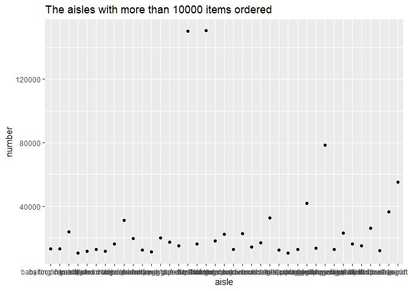
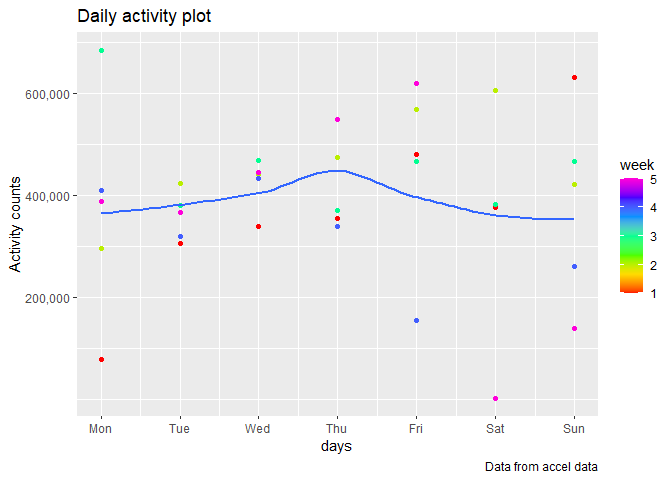
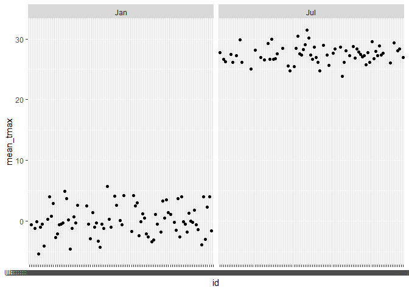
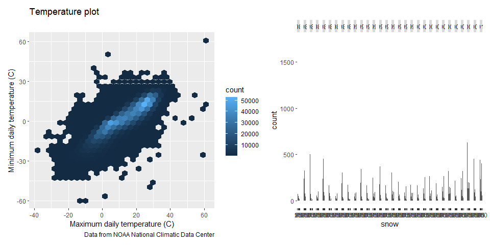

p8105_hw3_LL3407
================
2022-10-12

``` r
library(p8105.datasets)
data("instacart")

library(tidyverse)
```

    ## -- Attaching packages --------------------------------------- tidyverse 1.3.2 --
    ## v ggplot2 3.3.6      v purrr   0.3.4 
    ## v tibble  3.1.8      v dplyr   1.0.10
    ## v tidyr   1.2.0      v stringr 1.4.1 
    ## v readr   2.1.2      v forcats 0.5.2 
    ## -- Conflicts ------------------------------------------ tidyverse_conflicts() --
    ## x dplyr::filter() masks stats::filter()
    ## x dplyr::lag()    masks stats::lag()

``` r
library(ggridges)
```

## Problem 1

``` r
ins_df = 
  instacart %>% 
  janitor::clean_names() %>% 
  group_by(aisle) %>% 
  summarize(nobs=n()) %>% view()

  maximum = ins_df %>% filter(nobs==max(nobs)) %>% view() 
```

-   There are 134 aisles in total.  
-   The “fresh vegetables” aisle is the most ordered from.

``` r
ins_df2 = 
  instacart %>% 
  janitor::clean_names() %>% 
  count(aisle) %>% 
  filter(n>10000) %>%
  mutate(number=as.numeric(n)) %>% 
  arrange(number)
```

``` r
ins_high_scatter = 
    ins_df2 %>% 
    ggplot(aes(x=aisle, y=number, width=5, height=3))+
    geom_point()+
    labs(
      title = "The aisles with more than 10000 items ordered") 
ins_high_scatter
```

<!-- -->

``` r
ggsave(file = "./Results/ins_high_scatter.pdf",
       plot = ins_high_scatter)
```

    ## Saving 7 x 5 in image

``` r
ins_df3 = 
  instacart %>% 
  janitor::clean_names() %>%
  filter(aisle=="baking ingredients"|aisle=="dog food care"|aisle=="packaged vegetables fruits") %>%  
  select(aisle, product_name) %>%
  group_by(product_name, aisle) %>%
  summarize(n_obs=n()) %>% 
  ungroup() %>% 
  group_by(aisle) %>% 
  mutate(rank = min_rank(desc(n_obs)), na.rm=TRUE) %>% 
  filter(rank < 4) %>% 
  arrange(aisle, n_obs) %>% view()
```

    ## `summarise()` has grouped output by 'product_name'. You can override using the
    ## `.groups` argument.

``` r
ins_df4 = 
  instacart %>% 
  janitor::clean_names() %>% 
  filter(product_name == "Pink Lady Apples"| product_name=="Coffee Ice Cream") %>% 
  mutate(
    order_dow = replace(order_dow,order_dow == "0","Sunday")) %>% 
  mutate(
    order_dow = replace(order_dow,order_dow == "1","Monday")) %>% 
  mutate(
    order_dow = replace(order_dow,order_dow == "2","Tuesday")) %>% 
  mutate(
    order_dow = replace(order_dow,order_dow == "3","Wednesday")) %>%
  mutate(
    order_dow = replace(order_dow,order_dow == "4","Thursday")) %>%
  mutate(
    order_dow = replace(order_dow,order_dow == "5","Friday")) %>% 
  mutate(
    order_dow = replace(order_dow,order_dow == "6","Saturday")) %>% 
  pivot_wider(
    names_from = "order_dow",
    values_from = "order_hour_of_day"
  ) %>% 
  select(product_name,Sunday, Monday, Tuesday, Wednesday,Thursday, Friday,Saturday) %>% 
  mutate(Sunday=as.numeric(Sunday),
         Monday=as.numeric(Monday),
         Tuesday=as.numeric(Tuesday),
         Wednesday=as.numeric(Wednesday),
         Thursday=as.numeric(Thursday),
         Friday=as.numeric(Friday),
         Saturday=as.numeric(Saturday)) %>%
  group_by(product_name) %>% 
  summarize(
    mean_Sunday=mean(Sunday, na.rm=TRUE),
    mean_Monday=mean(Monday, na.rm=TRUE),
    mean_Tuesday=mean(Tuesday, na.rm=TRUE),
    mean_Wednesday=mean(Wednesday,na.rm=TRUE),
    mean_Thursday=mean(Thursday,na.rm=TRUE),
    mean_Friday=mean(Friday,na.rm=TRUE),
    mean_Saturday=mean(Saturday,na.rm=TRUE)) %>% view()
```

-   Description of data “instacart”  
    The “instacart” dataset contains 1,384,607 observations and 15
    variables in total.The Key variables includes order_id, aisle,
    product_name, department, order_dow,etc. For example, a product
    named “Bulgarian Yogurt” located in aisle of “yogurt” and department
    of “dairy eggs” was ordered once with the order number of 4 on
    Thursday with the order ID of “1”. It was a reordered product with 9
    days since prior order.

## Problem 2

``` r
library(tidyverse)
acc_df = read_csv("./data/accel_data.csv") %>% 
  janitor::clean_names() %>% 
  pivot_longer(
    activity_1:activity_1440,
    names_to = "activity_minute",
    names_prefix = "activity_",
    values_to = "activity_counts"
  ) %>% 
  arrange(week, day_id) %>% 
  mutate(
    day_num = recode(
      day,"Monday"= 1, 
          "Tuesday"=2,    
          "Wednesday"=3,
          "Thursday"=4,
          "Friday"=5,
          "Saturday"=6,
          "Sunday"=7)) %>% 
    mutate(
    week_day=case_when(
      day_num<6 ~ "weekday",
      day_num>=6 ~ "weekend",
      TRUE ~"")) 
```

    ## Rows: 35 Columns: 1443
    ## -- Column specification --------------------------------------------------------
    ## Delimiter: ","
    ## chr    (1): day
    ## dbl (1442): week, day_id, activity.1, activity.2, activity.3, activity.4, ac...
    ## 
    ## i Use `spec()` to retrieve the full column specification for this data.
    ## i Specify the column types or set `show_col_types = FALSE` to quiet this message.

-   Description the resulting dataset  
    \*\* The resulting dataet “acc_df” has a total of 7 variables
    (week,day_id,day,activity_minute, activity_counts, day_num, and
    week_day)and 50400 observations.

\*\* In addition to the 3 variables kept from the original dataset
(week, day_id, day), we tidy up the dataset with creating two new
varibles (activity_minute and activity_counts).  
\*\* In addition, we convert the character variable “day” into a numeric
variable “day_num”, and use it to classify the weekdays into weekday and
weekend.

``` r
acc_df2 = acc_df %>% 
  group_by(week,day_num) %>% 
  summarize(
    daily_activity = sum(activity_counts)) %>% view()
```

    ## `summarise()` has grouped output by 'week'. You can override using the
    ## `.groups` argument.

-   The total activity counts generally increase from Monday to Friday,
    and decrease on Saturday and Sunday.

``` r
library(ggridges)
accel_plot = 
  acc_df2 %>% 
  ggplot(aes(x=day_num, y=daily_activity, color = week, width=5,height=3),alpha=.5)+
  geom_point()+
  geom_smooth(se=FALSE)+
  labs(
    title = "Daily activity plot",
    x = "days",
    y = "Activity counts",
    caption = "Data from accel data" )+
  scale_x_continuous(
    breaks = c(1,2,3,4,5,6,7),
    labels = c("Mon","Tue","Wed","Thu","Fri","Sat","Sun"))+ scale_y_continuous(
    breaks = c(200000,400000,600000),
    labels = c("200,000","400,000","600,000")
    )+ scale_color_gradientn(colors = rainbow(7))
  
accel_plot
```

    ## `geom_smooth()` using method = 'loess' and formula 'y ~ x'

<!-- -->

``` r
ggsave(file = "./Results/accel_plot.pdf",
       plot = accel_plot)
```

    ## Saving 7 x 5 in image
    ## `geom_smooth()` using method = 'loess' and formula 'y ~ x'

-   From the single-panel plot, we may know that the average daily
    activity counts increase from Monday to Thursday (maximum), and then
    decrease from Thursday to Sunday.  
-   The highest daily activity count is on Monday of Week 3. The lowest
    daily activity count is on Saturday of Week 5.

## Problem 3

``` r
library(p8105.datasets)
data("ny_noaa")
```

``` r
noaa_NY = ny_noaa %>% 
  janitor::clean_names() %>% 
  separate(date, sep="-", into = c("year","month","day" )) %>% 
  mutate(tmin = as.numeric(tmin)/10,
    tmax = as.numeric(tmax)/10,
    prcp = as.numeric(prcp)/10,
    snow_cm = as.numeric(snow)/10) 
  
noaa_NY_1 = noaa_NY %>% 
  group_by(snow) %>% 
  summarize(n_obs = n()) %>% 
  arrange(desc(n_obs)) %>% view()
```

-   The most commonly observed values for snowfall is 0. It’s reasonable
    because NY usually only has snowfall in Winter.

``` r
library(patchwork)

noaa_NY_2 = noaa_NY %>% 
  group_by(id,month) %>% 
  summarize(
    mean_tmax = mean(tmax),na.rm=TRUE) %>% 
  drop_na() %>% 
  filter(month=="01"|month =="07") %>% 
  mutate(month=replace(month, month=="01","Jan")) %>% 
  mutate(month=replace(month, month=="07","Jul"))
```

    ## `summarise()` has grouped output by 'id'. You can override using the `.groups`
    ## argument.

``` r
tmax_Jan_Jul_plot = noaa_NY_2 %>% 
  ggplot(aes(x=id, y=mean_tmax))+
  geom_point()+
  facet_grid(~month)

tmax_Jan_Jul_plot
```

<!-- -->

``` r
ggsave(file = "./Results/tmax_Jan_Jul_plot.pdf",
       plot = tmax_Jan_Jul_plot)
```

    ## Saving 7 x 5 in image

-   The average maximum temperatures in July are higher than those in
    January. The average maximum temperatures in July approximately
    range from 24 C to 31 C. The average maximum temperatures in January
    approximately range from -6 c to 6 C. No obvious outlier is
    observed.

``` r
tmax_tmin_plot = noaa_NY %>% 
  ggplot(aes(x = tmax, y = tmin))+
  geom_hex() +
  labs(
    title = "Temperature plot",
    x = "Maximum daily temperature (C)",
    y = "Minimum daily temperature (C)",
    caption = "Data from NOAA National Climatic Data Center" )

snowfall_hist = noaa_NY %>% 
  select(year,snow) %>% 
  mutate(snow = as.numeric(snow)) %>% 
  mutate(year = as.numeric(year)) %>% 
  filter(snow > 0 & snow < 100 ) %>% 
  arrange(year) %>% 
  ggplot(aes(x=snow,width=35,height=5))+
  geom_histogram()+
  facet_grid(.~year)
  
   
tmax_snow_plot = (tmax_tmin_plot+snowfall_hist)

tmax_snow_plot
```

    ## Warning: Removed 1136276 rows containing non-finite values (stat_binhex).

    ## `stat_bin()` using `bins = 30`. Pick better value with `binwidth`.

<!-- -->

``` r
ggsave(file = "./Results/tmax_snow_plot.pdf",
       plot = tmax_snow_plot)
```

    ## Saving 10 x 5 in image

    ## Warning: Removed 1136276 rows containing non-finite values (stat_binhex).

    ## `stat_bin()` using `bins = 30`. Pick better value with `binwidth`.
